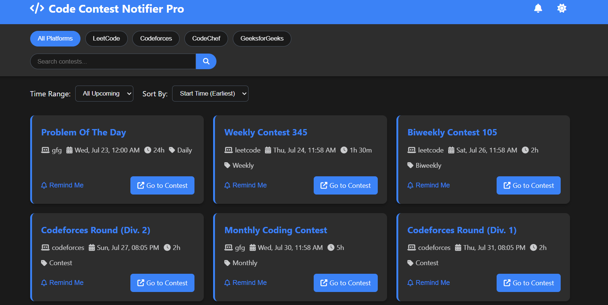
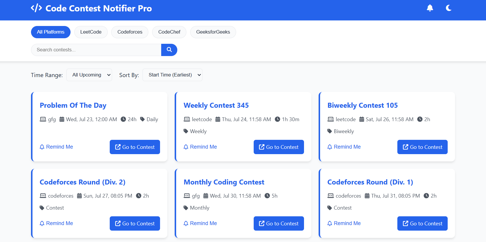

⚡ Contest Notifier
Your one-stop platform to stay updated with all the upcoming programming contests from major competitive coding platforms.

🚀 Features
🔍 Unified Contest Dashboard
See all ongoing and upcoming coding contests at a glance from popular platforms:

✅ Codeforces (Live Data)

✅ CodeChef (Live Data)

⚠️ LeetCode (Static or Mock Data)

⚠️ GeeksforGeeks (Static or Mock Data)

🌙 Dark Mode / Light Mode
Switch between elegant dark and clean light themes with a single toggle.

🔎 Search Functionality
Quickly search for contests by platform, name, or keywords.

🎯 Smart Filters
Easily sort contests based on:

📅 Earliest First

🕓 Latest First

⏱️ Longest Duration

⚡ Shortest Duration

💡 Responsive & Clean UI
Built with a focus on user experience, accessibility, and responsiveness.

⚙️ Tech Stack
Frontend: HTML, CSS, JavaScript

Data: Fetched using APIs (Codeforces & CodeChef), Mock Data (LeetCode & GFG)

Design: Clean, minimalist, responsive design with theme toggle

🛠️ Future Improvements
✅ Live integration for LeetCode and GFG contests

📅 Add calendar sync or reminders

🔔 Push notification support

📊 Contest analytics and performance tracking

🙌 Contributing
Contributions are welcome! Feel free to fork this repo and raise a pull request to add new features or improve existing ones.

📄 License
This project is licensed under the MIT License.

